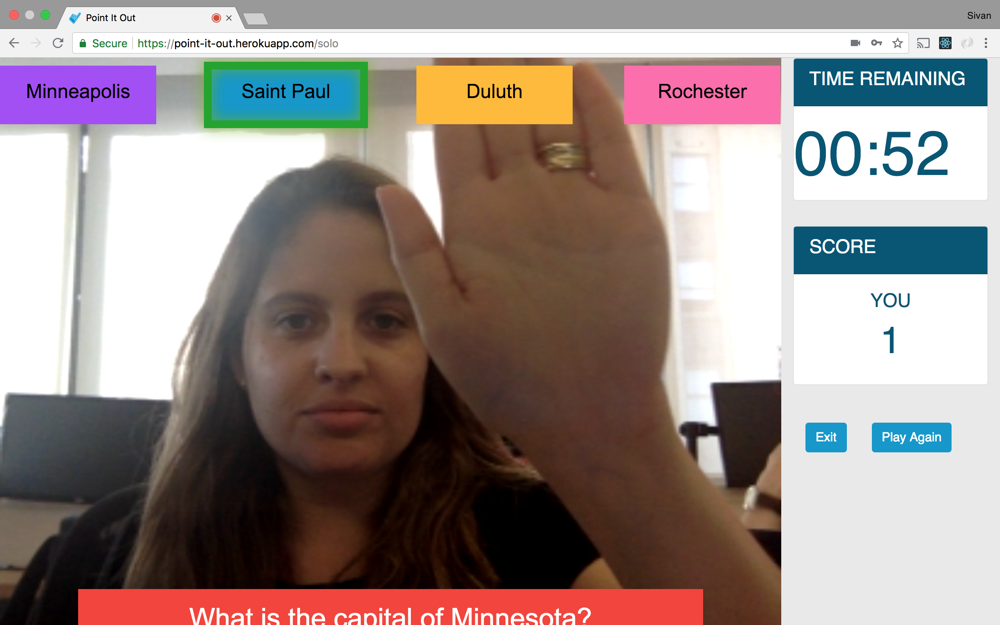
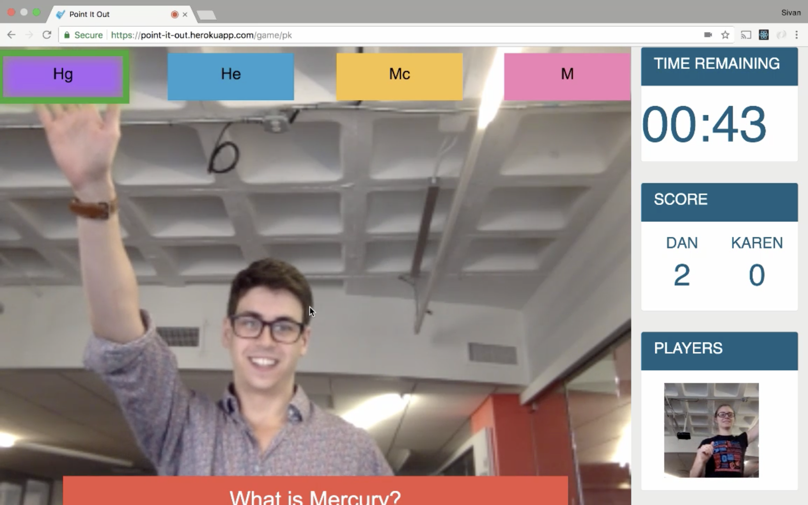
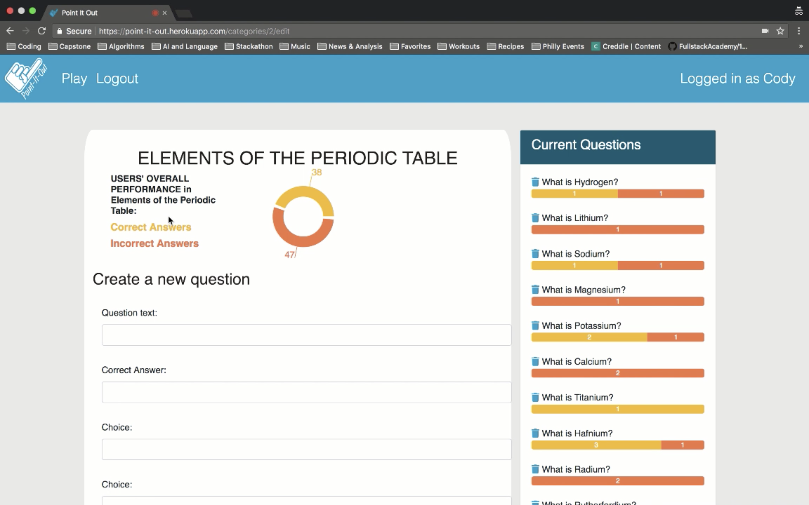

# POINT-IT-OUT:

Point-it-out is a augmented-reality review game you can play alone or with a friend. It works on any computer with a webcam. Users race against the clock to answer as many questions as possible, earning points (and the possibility to sabotage your opponent!) along the way. Teachers, students, and game night hosts can create their own quizzes tailored to their needs. To check it out for yourself, head on over to https://point-it-out.herokuapp.com

[Watch the project video](https://youtu.be/NEukWTyIW0A)

#### PREREQUESITES:
After forking and cloning the project, run 'npm install' to download all the necessary dependencies. You must create two databases for the project: pointItOut and pointItOut-test.

#### GETTING STARTED:
The command 'npm run start-dev' will run the app in development mode on your local machine. To run the server and/or webpack separately, use 'npm run start-server' and 'npm run build-client.'

#### SCREENSHOTS:

Single Player Mode:

Single Player end of game:

Multiplayer Mode:

Category creation/edit:

#### RUNNING TESTS:
All test files end with .spec.js. The command 'npm test' will run all tests for the project. You must have a database named pointItOut-test in order to run the test files.

## AUTHORS:
Alexandra Ash,
Amy Berg,
Kate Dubitski Kopitchinski,
Sivan Gilead

## App created using:
Node, Express, Sequelize, PostgreSQL, React, Redux, React-Redux, React-Router. 
## Aditional libraries and API's:
[react-Konva](https://github.com/konvajs/react-konva), [Opentok](https://tokbox.com/), [clmtrackr](https://github.com/auduno/clmtrackr), [Diffyjs](https://www.npmjs.com/package/diffyjs), [butter-toast](https://github.com/ealush/butter-toast), [react-confetti](https://www.npmjs.com/package/react-confetti), [react-countdown](https://github.com/ndresx/react-countdown), [recharts](https://github.com/recharts/recharts)

